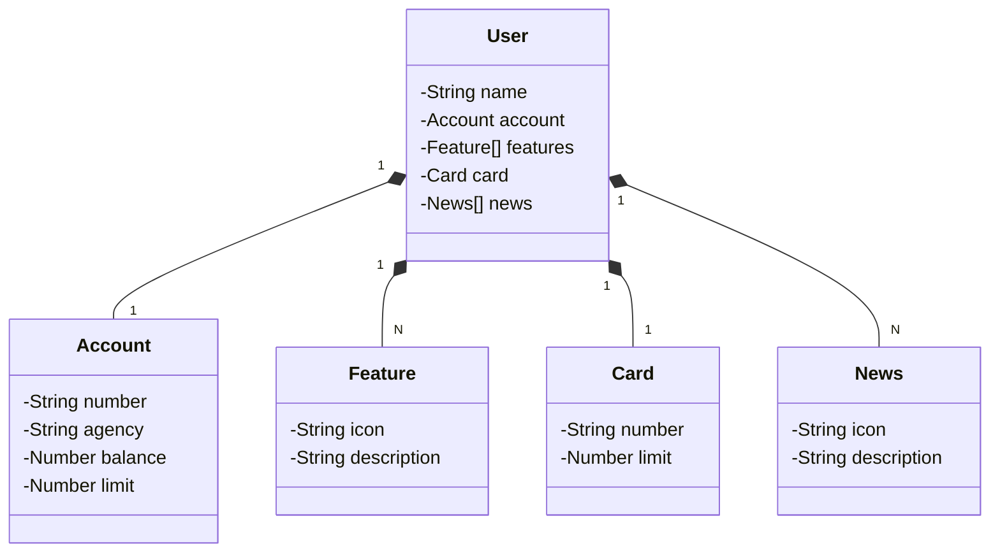

# Santander Dev Week 2023

## Spring Initializr

[Spring Initializr - download](https://start.spring.io/#!type=gradle-project&language=java&platformVersion=3.1.2&packaging=jar&jvmVersion=17&groupId=br.com.carlosjunior&artifactId=santander-dev-week-2023&name=santander-dev-week-2023&description=Java%20RESTful%20API%20Santander%20Dev%20Week%202023&packageName=br.com.carlosjunior.santander-dev-week-2023&dependencies=web,data-jpa,h2,postgresql)

## Diagrama de Classes



## Swagger

[Swagger Local](http://localhost:8080/swagger-ui/index.html)

Body Post
````
{
  "name": "Carlitos",
  "account": {
    "number": "123456-0",
    "agency": "001-0",
    "balance": 100.10,
    "limit": 83734.98
  },
  "card": {
    "number": "XXXX-XXXX-XXXX-1234",
    "limit": 7800.00
  },
  "features": [
    {
      "icon": "URL_ICON",
      "description": "Descrição da funcionalidade"
    }
  ],
  "news": [
    {
      "icon": "URL_NEWS",
      "description": "Descrição da notvidade"
    }
  ]
}
````

## Publicação em Railway
[Railway.app](https://railway.app/)